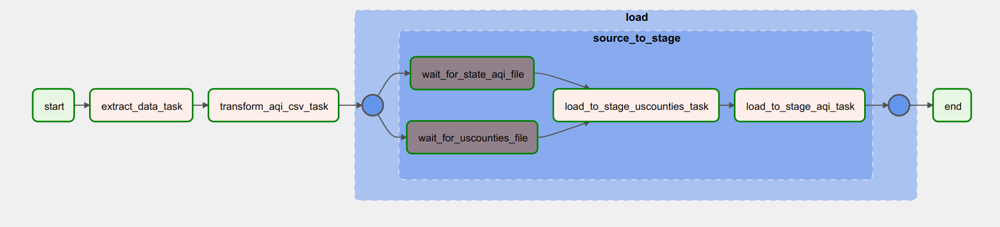
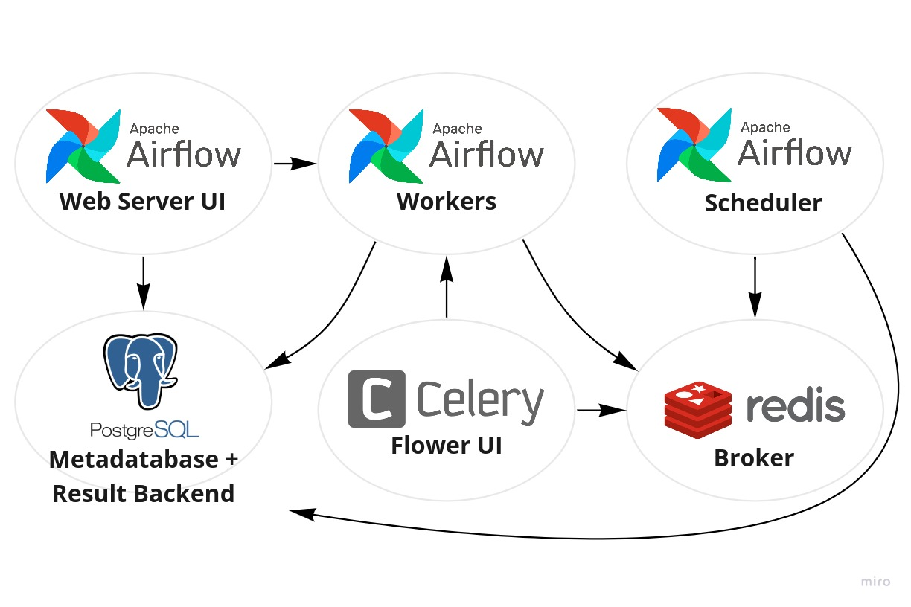

# ETL Project Using Airflow and Docker

**Author**: Nguyen Le Hoang Kha

## Project Overview

In this project, I will leverage Docker to build an ETL (Extract, Transform, Load) pipeline using **Airflow** and other tools. The goal is to automate the extraction, transformation, and loading of air quality index (AQI) data from the U.S. Environmental Protection Agency (EPA) into a MySQL database.

## Pipeline Structure

The ETL pipeline consists of three main stages: Extract - Transform - Load

### 1. **Extract**

In the extract stage, I will:

- Use the **`requests`** Python library to download AQI data files from the [EPA's Air Quality System (AQS) website](https://aqs.epa.gov/aqsweb/airdata/).
- After downloading the file, I will unzip it and store it as a CSV file.

### 2. **Transform**

In the transform stage, I will:

- Change the header names of the CSV file to ensure consistency and readability.
- Add two new columns: `created` and `updated`, to track when the record was created and when it was last updated.

### 3. **Load**

In the load stage, I will:

- Load the transformed data into two tables inside a **MySQL database** for further analysis and reporting.

## What I Learned from This Project

### Using Airflow with Celery Executor

- In this project, I used **Airflow Celery Executor** for task distribution and parallelism. I learned the importance of splitting each component of the pipeline into separate Docker containers to ensure scalability and efficient execution.

### Docker: Volume Mounts and Container Networks

- To implement the architecture, I learned how **Docker volumes** and **container networks** work. I was amazed by how Docker volumes allow persistent storage outside the container, and how container networks enable different containers (e.g., MySQL, Airflow workers, and web servers) to communicate with each other seamlessly **through Postgres Database**.

### Airflow Celery Architecture Diagram

To better illustrate the architecture of this project, here's a diagram:

_The image above shows how the components are split into separate containers and communicate through Docker networks._

## Improvement in future

In the future, I plan to enhance this project by designing a **data warehouse** with the following architecture: **Stage (Raw Data Layer)** - **NDS (Normalized Data Store)** - **DDS (Dimensional Data Store)** using **Incremental Extraction** method.
